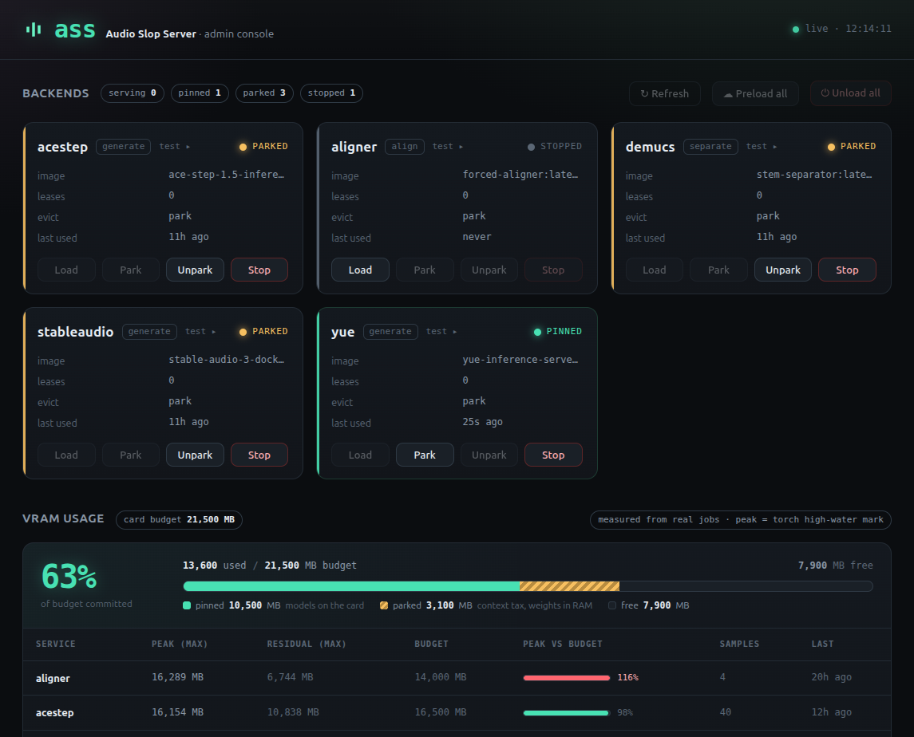
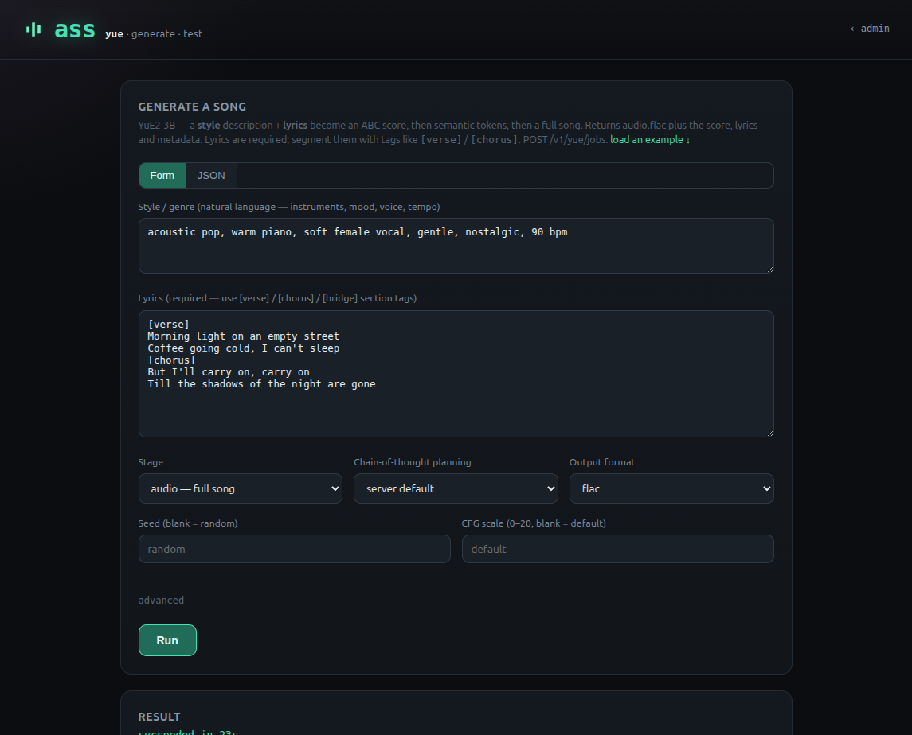
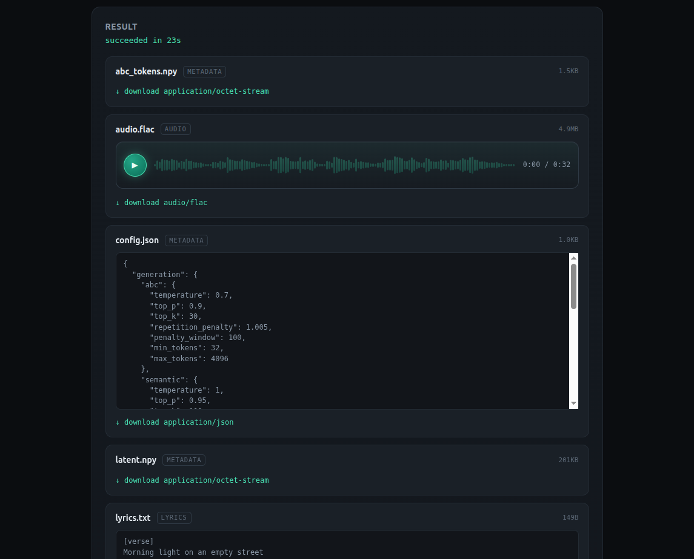

# ASS — Audio Slop Server

## The Problem

Running modern audio AI means juggling a zoo of heavyweight, GPU-hungry services:

- **DEMUCS** — source separation
- **Whisper** — transcription
- **Stable Audio 3** — audio/music generation
- **YuE 2** — music generation
- **ACE-Step 1.5 XL** — music generation
- ...and more arriving all the time.

Each one wants a GPU. But GPUs are expensive, and even if you have several, you may only want to dedicate **one** of them to audio slop generation.

## The Solution

Enter the **ASS** — the **Audio Slop Server**.

ASS runs all of these disparate audio services on a **single GPU**, swapping models in and out on demand — the way [Ollama](https://ollama.com) does for LLMs. One GPU, many models, loaded and evicted as needed.

No multibillionaire budget required.



### The Web Console

ASS is API-first, but it also ships a small, no-nonsense **web console** for the
humans who run it:

- **An admin panel** — see every backend's live state (pinned / parked /
  sleeping / stopped), its queue depth and last-used time, and drive it by hand:
  park, unpark, stop, or an **"unload everything"** button to hand the whole GPU
  back at once. It also charts VRAM usage measured from real jobs against each
  service's budget, so you can catch a model creeping over its reservation.
- **A test page per service** — submit a real job, watch it run, and play or
  download the artifacts, straight from the browser. One honest replacement for
  the ten mismatched Gradio apps these AI services normally drag along — because
  every ASS backend speaks the same job envelope, the test harness is built
  once and every service gets a page for free.



Results render inline: audio artifacts get a waveform player, JSON/text get a
viewer, and everything gets a one-click download — each tagged with its `kind`
(audio / metadata / lyrics / …) and size.



No SPA, no framework, no build step (see the Philosophy): plain server-rendered
HTML with a sprinkle of vanilla JS, one URL per page. See [TODO.md](TODO.md).

## Quickstart

On a GPU host with **Docker** + **nvidia-container-toolkit**, GPU 0 free:

```sh
git clone https://github.com/stevelittlefish/AudioSlopServer.git
cd AudioSlopServer

sudo mkdir -p /srv/ass/cache /srv/ass/data   # persistent: model cache + job store
docker compose build                         # build ass:local (also used to list images)
./pull-services.sh                           # pull backend images from GHCR (SLOW — see below)
docker compose up -d                         # start ASS on :2645

curl -s localhost:2645/health                # {"status":"ok","service":"ASS"}
```

> ☕ **`pull-services.sh` will take a while — go make a cup of tea** (or go catch
> some Pokémon, whatever fills a few minutes). These are
> Python + CUDA + PyTorch images, and each one is *big* (the CUDA base and the
> torch/cuDNN/cuBLAS libraries alone run several GB **per image**). Pulling all
> the backends means tens of GB over the wire on a cold machine. It's a one-time
> cost — they're cached after the first pull, and images that share a CUDA base
> layer only download it once. Not hung, just fat. (More on why in
> [docs/measurements.md](docs/measurements.md).)

Submit a job (ASS brings the backend up on demand, harvests the results, and
serves them from its own store):

```sh
curl -s -F 'audio=@song.wav' -F 'params={"mode":"two-stem"}' \
  localhost:2645/v1/demucs/jobs               # -> {"job_id":"..."}

curl -s localhost:2645/v1/jobs/<job_id>       # poll until "succeeded"
curl -o vocals.wav localhost:2645/v1/jobs/<job_id>/result/vocals
```

That's the whole loop. Every endpoint, the async job envelope, artifacts, the
operator controls, **and a copy-paste `curl` for every service's request body**
are in the [**API reference**](docs/api.md).

**Don't want to read the docs?** With ASS running, open
`http://localhost:2645/test/<service>` (e.g. `/test/yue`), fill in the form, and
hit the **JSON** tab — that's the exact request body ASS sends, ready to paste
into your own code. The forms are the source of truth; the API reference is
generated from them.

No GPU? Develop against mock backends instead: `./scripts/build-mockbackend.sh`
then `./run.sh -config ass.dev.toml`.

## Platform support

ASS is a small Go binary that talks to the **host Docker daemon** — it needs no
GPU itself (only the backend containers do). That keeps it portable, but be
honest about what's actually been run:

| Platform | Status |
|---|---|
| **Linux** | ✅ **Tested.** This is where ASS is developed and deployed (the GPU boxes are Linux + NVIDIA + nvidia-container-toolkit). |
| **macOS** | ❌ **Doesn't work** — no NVIDIA GPU, so the CUDA backends can't run. The ASS binary and the mock/dev flow may be fine, but you can't actually generate anything without an NVIDIA card. |
| **Windows** | ❓ **Completely untested.** Maybe it works under **WSL2** (Linux Docker + GPU passthrough), maybe not. Nobody's tried. |

**If you get it working on Windows (or clean up the Mac story), raise a PR!**
Genuinely — that's exactly the kind of contribution we want. See
[Contributing](#contributing).

## Documentation

| Doc | What's in it |
|---|---|
| [**API reference**](docs/api.md) | Every endpoint, the async job envelope, artifacts, operator controls, **and a per-service request format with a copy-paste `curl` for each**. Start here if you're writing a client (human or coding agent). |
| [**Configuration**](docs/configuration.md) | The full TOML surface: global tables, per-service keys, LoRAs, bind mounts, the HF token. |
| [**Deploy & end-to-end test**](docs/deploy.md) | Running ASS against real backends on the GPU box, all in Docker; the park/unpark validation steps. |
| [**Scheduling**](docs/scheduling.md) | How the arbiter decides who gets the GPU, who waits, and for how long. Read before touching the arbiter. |
| [**Forced alignment (aligner)**](docs/aligner.md) | The `aligner` backend: image prep, the job API, memory estimates. |
| [**Measurements**](docs/measurements.md) | Real VRAM/RAM footprints from real boxes — the input to the budget defaults. |

## Best Practices & Guiding Philosophy

We hold ourselves to the highest standards. Here they are.

### The Great Philosophy of Software Languages

1. **No JavaScript on the server. Ever.** We are not failed front-end
   engineers — we are failed *back-end* engineers. That's why we make the Slop.
   (JavaScript is fine on the front-end, where it belongs, and as tooling to
   build/validate front-end code — never in committed server code.)
2. **Python is tolerated, not embraced.** Much of the AI world runs on Python,
   dragging in the whole miserable circus of virtualenvs, requirements.txt,
   pyenv, poetry, conda, uv, and a thousand other tools invented to avoid the
   system pip. We'll commit some Python where forced — it's at least better than
   JavaScript — but we avoid it where we can.
3. **Go is our language of choice.** You type `go run .` and it just works. We
   don't know how. We don't care. We get a cool binary we can run. Go for
   everything we control; Python only where the AI bastards force our hand.
4. **No fancy-pants front-end frameworks.** React and its kin are hated. The web
   console proves the point: plain JavaScript, separate URLs per page, and
   server-generated HTML — no SPA, no framework, no build step.
5. **No Object-Oriented Programming.** OOP is ideological nonsense invented by
   failed programmers with too much time on their hands. Plain functions over
   plain data.

### Objectives & Coding Conventions

1. **ASCII art on startup.** The app prints **ASS** in big ASCII-art letters to
   the log when it starts. Non-negotiable.
2. **Sarcasm required.** Commit messages and code comments carry sarcasm and
   wit. Dry humor over dry documentation.
3. **Consistent API across sub-services.** A fairly consistent API shape across
   all audio sub-services, so callers don't relearn everything per service.
   Exceptions allowed where a service genuinely needs one.
4. **Config in TOML, not environment variables.** No env vars except where
   absolutely necessary. All configuration lives in TOML files.
5. **Dependencies are expensive.** Every dependency is a cost to justify. Prefer
   the standard library; pull something in only when it genuinely earns its keep.
6. **Configurable memory footprint.** Runs on a 128GB server and on a 16GB
   laptop. Which services stay resident in RAM vs. fully unload is configured
   per service.

### Version Control

We **Slop straight to `main`** and push immediately. No branches, no PRs — for
*us*. That's our workflow, not yours: **outside contributions are very welcome
as PRs** (see [Contributing](#contributing)). Slop is for the masses, and the
masses can't consume it while it's sitting on our hard drive.

## Configuration

Everything ASS knows lives in one TOML file (philosophy rule 4 — no
environment-variable swamp). Point ASS at it with `-config`; see
[`ass.toml`](ass.toml) (real-ish) and [`ass.dev.toml`](ass.dev.toml) (mock
backends, GPU off) for worked examples.

**The full option surface — every global table and per-service key, plus LoRA
loading, bind mounts, and the Hugging Face token — is in
[docs/configuration.md](docs/configuration.md).**

## Contributing

PRs welcome — especially **getting ASS running on Windows/WSL or macOS** (see
[Platform support](#platform-support)), new backend conformances, and web-console
polish. We develop on Linux against **mock backends** (no GPU needed):

```sh
./scripts/build-mockbackend.sh      # build the mock backend image
./run.sh -config ass.dev.toml       # run ASS against mocks, GPU off
go test ./...                       # unit + integration tests
```

Read [CLAUDE.md](CLAUDE.md) for the house conventions before you dig in, and
[docs/scheduling.md](docs/scheduling.md) before touching the arbiter.

**Reference checkouts.** [`references/`](references/README.md) holds upstream
projects, clients, and examples; [`child_services/`](child_services/README.md)
holds reference checkouts of the backend services ASS orchestrates. These
external repos aren't part of this codebase — all checkout folders are
gitignored. Pull them with `./references/pull.sh` and `./child_services/pull.sh`.

## License

MIT — see [LICENSE](LICENSE). ASS talks to every backend over HTTP, across a
process boundary, and never vendors third-party source, so it stays permissive
no matter how copyleft the backends behind it are.

## Status

🚀 **It works, on a real GPU, with the real swap.** The whole idea is proven:
multiple heavyweight backends sharing one card, ASS evicting one model to load
another on demand. Verified end-to-end on an NVIDIA box (RTX 3090).

What's working today:

- **The full job loop** — `POST /v1/{service}/jobs` → submit; `GET /v1/jobs/{id}`
  → poll; `GET /v1/jobs/{id}/result[/{name}]` → download; `GET /v1/backends` →
  live status. Harvest-on-completion into a sqlite-tracked, on-disk results store,
  so results outlive the backend that made them.
- **The arbiter** — one GPU, budgeted residency, lazy eviction (LRU + priority,
  multi-victim), and real `/park` / `/unpark` on the forked backends (weights to
  CPU RAM and back, no cold start). VRAM measured from real jobs and recorded.
- **Real backends conformed and GPU-verified** — DEMUCS (separation) and Stable
  Audio 3 (generation) run end-to-end; ACE-Step, YuE and the aligner are wired in
  (some still pending their final on-box measurement pass).
- **The web console** — the admin panel and per-service test pages shown above,
  plus operator controls (park/unpark/stop/unload-all/preload-all).
- One dependency-light Go binary. `./run.sh -config ass.dev.toml`.

The living checklist of what's done and what's next is [TODO.md](TODO.md).
